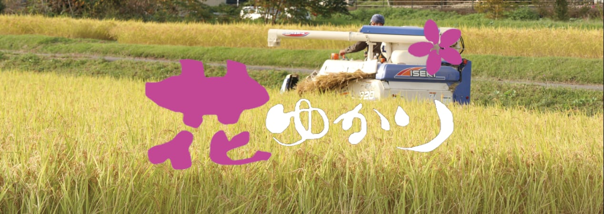
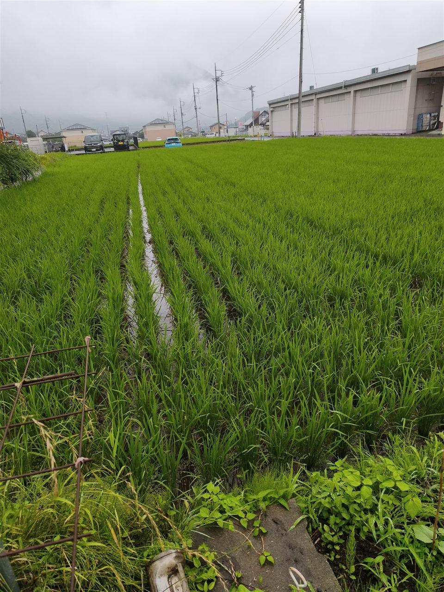
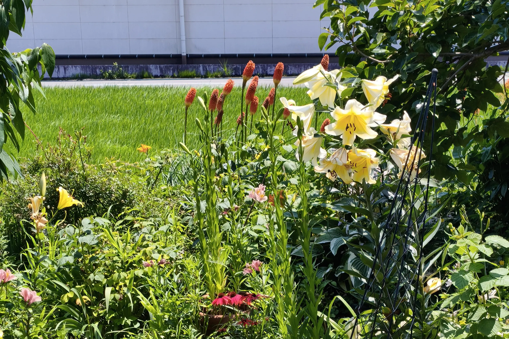
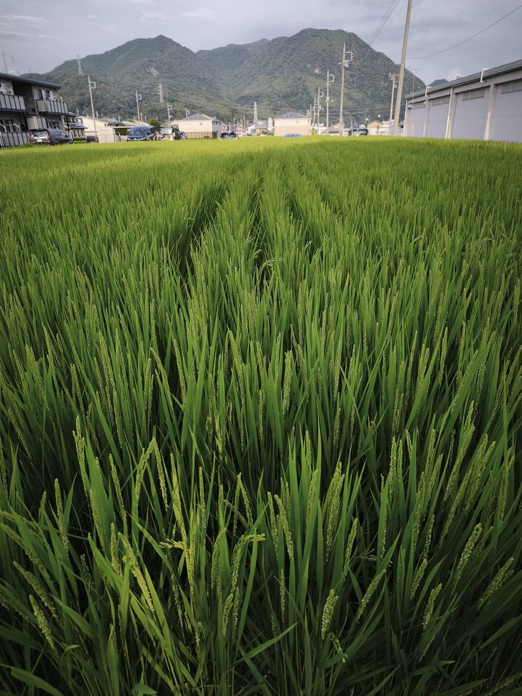
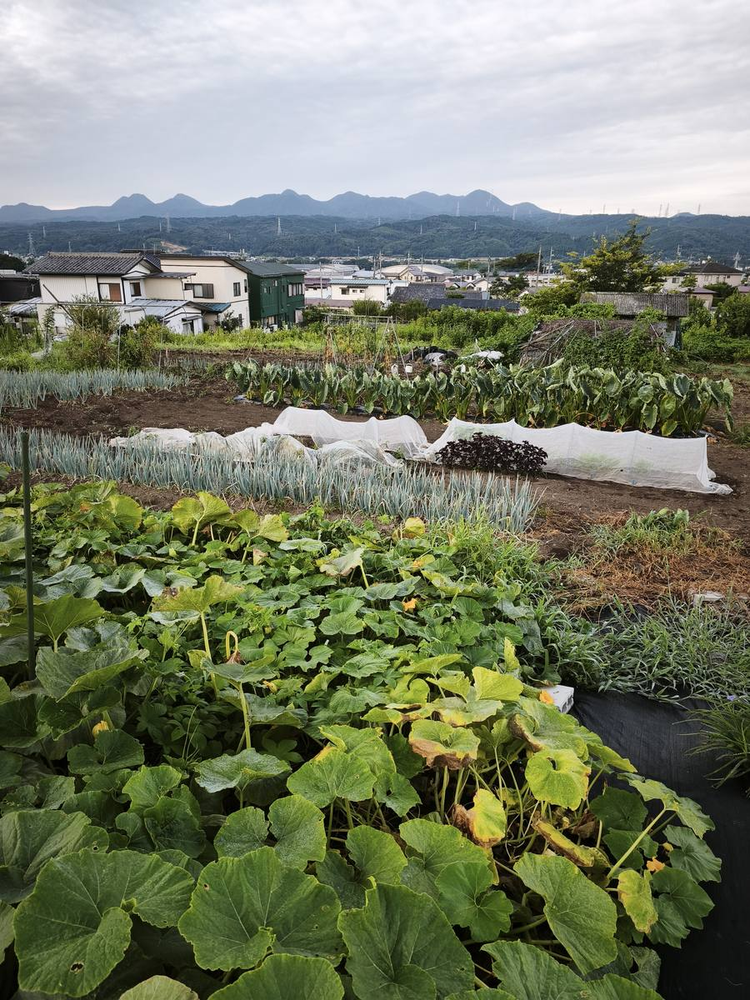

# Fields and Paddies: Nakanojo

This file is the **English landing-page manuscript**. Edit it in VS Code or Obsidian. The live site is still served by `index-en.html`.

Farm name: Sato Farms  
URL: https://satofarms.com (satofarms.com)  
Address: 15-6 Ise-machi, Nakanojo-machi, Agatsuma-gun, Gunma-ken  
Representative: Setsuo Sato

---

## Hero

Protecting Japan's small-scale farming and rice cultivation

**Fields and Paddies: Nakanojo**

—— The bounty of Nakanojo, nurtured by rice fields and farms ——

A small, family-run farm dedicated to Koshihikari rice, seasonal vegetables, and fresh fruits.  
Bringing you safe, delicious produce, grown with honesty and care.

Sato Farms URL　https://satofarms.com (satofarms.com)

* The background landscape is an AI-generated image.

Japanese version available: [日本語で読む](../index.html)

---

## Current notices

**[A Difficult Decision — We Are Putting Our Direct Sales System off](../blog-en/notes/a-difficult-decision.html)**

**[Grow-as-We-Go Direct Sales] Nakanojo's delicious rice “Sato Rice” (Koshihikari)**

■2026 harvest: Purchase guide here　■Pre-registration here

Sato Farms URL　https://satofarms.com (satofarms.com)

---

## What's New

The full news list has moved to the [blog news archive](../blog-en/news/). Only the latest 5 items appear here.

- August 31, 2026　A Difficult Decision — We Are Putting Our Direct Sales System off—[Read](../blog-en/notes/a-difficult-decision.html).
- August 30, 2026　A Cool White Dance in Summer — The Sagi-so Festival in Nakanojo—[Read](../blog-en/notes/sagiso-festival.html).
- August 29, 2026　Sato Farms: An Autumn Growing Note — Just Talking to Myself—[Read](../blog-en/notes/satofarms-autumn-note.html).
- August 27, 2026　Koshihikari — The Rice That Became Japan’s Favorite—[Read](../blog-en/notes/koshihikari-rice.html).
- August 27, 2026　Getting Rid of the Daily Hassle: A System That Took Two Months to Build—[Read](../blog-en/notes/daily-automation.html).

[See all news →](../blog-en/news/)

---

## Nakanojo: A Land of Nature and Hot Springs

Rice Paddies and Fields of the Agatsuma Region

This landscape is an image generated by generative AI.

Located in northwestern Gunma's Agatsuma region, Nakanojo is a town blessed with pristine nature and famous hot springs like Shima Onsen and Sawatari Onsen. Pure subterranean water from the Shima and Nakuta Rivers, significant day-and-night temperature swings, and lush forests create the perfect *terroir* that nurtures the rich flavor of Sato Farms' rice and vegetables.

- **Subterranean water from the Shima & Nakuda Rivers**　Mineral-rich water nourishes the paddies
- **Four seasons of Agatsuma**　Temperature swings concentrate flavor in our crops
- **Fields and paddies**　Koshihikari rice and seasonal vegetables
- **Hot springs & nature**　Renowned onsen towns including Shima and Sawatari

### Sightseeing links

- [Nakanojo　Sightseeing links](../blog-en/links/#spots-nakanojo)　Hot springs, nature, and culture
- [Agatsuma　Sightseeing links](../blog-en/links/#spots-agatsuma)　Kusatsu, Yanba, Tsumagoi, and more

---

## About Sato Farms

**Sato Farms** is a small, family-run farm nestled in Nakanojo, Gunma Prefecture. We grow premium Koshihikari rice, seasonal vegetables, and fruits like plums and persimmons. Our approach to farming is rooted in sincerity and care—values shaped by my rewarding years of experience in both education and healthcare.

We are committed to delivering safe, delicious produce by paying close attention to every step, from soil preparation to harvest.

---

## Products & cultivation

Rice fields, vegetable plots, and fruit trees. Sales to friends, acquaintances, and neighbors. Current offerings and rice achievements.

### Potato

Cabbage Season is over.

**Currently on sale at 30% off the retail price.**  Currently sold to friends, acquaintances, and neighbors.

¥-----

Order

### Koshihikari

Rice fields — cultivation

Reiwa 5 (2023) results: Koshihikari  
1) First Grade, Taste Score 90  
2) "Hanayukari" certified.

[2026 harvest rice guide](#2026-grow-as-we-go-direct-sales-for-our-rice)

### Persimmons & Plums

Fruit trees — cultivation

Fruit trees: Persimmons, plums  
Dried persimmons, pickled plums (umeboshi)  
Also drying sweet potatoes into hoshi-imo.

Stock & sales — inquire

### Harvest

- Harvested　Garlic / Cabbage / Potato / Onion
- Currently harvesting　Cucumber / Tomato / Eggplant

---

## Our message

Protecting Japan's small-scale farming and rice cultivation

At Sato Farms, in our small paddies and fields in Nakanojo Town, we work on Koshihikari rice cultivation and vegetable growing.

Reiwa 5 (2023) — **First Grade Koshihikari**, **Taste Score 90**, **"Hanayukari" certified**. On the other hand, in recent years we have been struggling with **weeds**, and there are days when we feel discouraged.  
We hope to share, even a little, the everyday joys and struggles of small-scale part-time farmers.

[documents/hanayukari.pdf](../documents/hanayukari.pdf) (Click to open the PDF in a small window. This page stays open.)

---

## Rice Trends in Agatsuma District

- Gunma Prefecture's rice varieties differ by region. Double-cropping areas in central, western, and eastern Gunma center on "Goropikari" and "Asahi no Yume," while single-cropping areas in the north and east, including Agatsuma District, center on "Koshihikari."
- Koshihikari from the Hokumo region has earned the top "Special A" rating in Japan's national rice-tasting rankings three times (2008, 2009, and 2020 harvests).
- In recent years, cultivation of the new variety "Niji no Kirameki" has been expanding in the prefecture, and it was added to Gunma's official regional variety list for the 2025 harvest.
- "Niji no Kirameki" features Koshihikari-level taste, plus heat tolerance, higher yield, lodging resistance, and strong resistance to rice stripe disease.
- Koshihikari remains dominant in the district, but heat-tolerant varieties are likely to be adopted and used alongside it in the future.　July 5, 2026

Nakanojo brand rice “Hanayukari” is here → [Hanayukari](https://hanayukari.base.ec/)

Nakanojo rice “Sato Rice” is here → [Member registration](#pre-register)

---

## Field & Paddy Updates

The photo gallery now lives on the [farm updates page](../blog-en/field-report/). This is just a preview. “The Potato Massacre” has moved to a [Farm Blog post](../blog-en/notes/potato-massacre.html).

Photos and short notes from our fields and paddies, updated from time to time.

July 5, 2026. Our rice paddies.

July 15, 2026. Red hot pokers and lilies.

August 19, 2026. Our rice paddies.

August 19, 2026. Our vegetable fields.

[See more farm photos →](../blog-en/field-report/)

---

## Representative Profile

Setsuo Sato, Representative — Sato Farms

A small farm in Nakanojo-machi, Agatsuma-gun, Gunma—growing Koshihikari rice, vegetables, and fruit trees.  
I bring the integrity cultivated in education and healthcare to my daily work in the fields.

### Timeline

- **Education**　Bachelor of Arts, School of Education / Department of English Language and Literature / Waseda University / Completed the adult course, Gunma Prefectural Agriculture and Forestry College
- **Current**　Full-time farmer: Ski instructor during winter
- **Career**　Served at six public high schools in Gunma Prefecture / Worked at a nursing school in the county
- **Farming**　Rice fields: Koshihikari / Fields: Seasonal vegetables / Fruit trees: Persimmons, plums / Others: Dried persimmons, pickled plums, dried sweet potatoes
- **Hobbies/Interests/Concerns**　[Click here](#hobbiesinterestsconcerns)

Fifty years of skiing history----Currently updating my personal best run.

In other words, that just goes to show how terrible I've been all these years...

During the winter, I work as a full-time ski instructor, sharing the joy of skiing with international visitors. Drawing on my background in education, I provide clear, encouraging lessons for beginners through intermediate skiers.

---

## Farm Blog

The old Random Thoughts section (#soliloquy) has moved to the [blog index](../blog-en/). Full posts are there.

Posts, news, and farm updates now live on dedicated pages. Here are a few featured posts.

- August 31, 2026　[A Difficult Decision — We Are Putting Our Direct Sales System off](../blog-en/notes/a-difficult-decision.html)　Sato Farms
- August 30, 2026　[A Cool White Dance in Summer — The Sagi-so Festival in Nakanojo](../blog-en/notes/sagiso-festival.html)　A sign about Sagi-so at the exhibition
- August 29, 2026　[Sato Farms: An Autumn Growing Note — Just Talking to Myself](../blog-en/notes/satofarms-autumn-note.html)　Just what I need. Just what I need for today.

[View the blog](../blog-en/)

---

## Frequently asked questions

### Can the general public purchase from you?

Sales are for friends, acquaintances, and neighbors. If you have a connection, please call our landline to inquire.

### What rice do you grow, and what is its quality?

We grow Koshihikari. Reiwa 5 results: First Grade, Taste Score 90, "Hanayukari" certified. Stock and pricing vary by season.

### What is available now?

Cabbage at ¥100 is currently available. Rice availability varies — please call to inquire.

### How do I order or inquire?

Please call [0279-75-2711](tel:0279752711), mobile [080-1256-8883](tel:08012568883), or email [2324satou.setuo@gmail.com](mailto:2324satou.setuo@gmail.com) (Representative: Setsuo Sato).

### About the name "Sato Farms"

"Sato Farms" is the name Setsuo Sato uses as an individual farmer. It is not a name registered as a corporation or trade name.

### Hobbies/Interests/Concerns

- Staying healthy (jogging)
- Watching MLB
- Making soba noodles (beginner)
- Secretary, landscaping group "Yotsumegaki"
- Custom PC builds (next: my dream 4th machine)
- **Tech & AI:** Utilizing generative AI tools like Cursor and Obsidian.
- **FX (Foreign Exchange) Trading:** My results may be unimpressive, but my experience is second to none. Having been through many tough battles, I'm now a 20-year veteran. I teach USD/JPY trading know-how.
- **Home Maintenance:** Managing and repairing my aging birth home.
- **Current Project:** I am currently compiling a bilingual "Ski English Expression Guide" (English/Japanese comparison). It is now nearly complete!
- Launching this website has been a dream of mine for over ten years. Now, through this web space, there are three things I'd like to express about who I am today: first, recent footage of my skiing; second, the "Uirō-uri" recitation (kōjō), which I have completely memorized; and third, footage of me chanting the Heart Sutra (Hannya Shingyō). I've always thought I'd like to post videos someday—but how will it actually turn out, I wonder?

---

## Directions

15-6 Ise-machi, Nakanojo-machi, Agatsuma-gun, Gunma-ken

- **Address**　15-6 Ise-machi, Nakanojo-machi, Agatsuma-gun, Gunma-ken 377-0423, Japan
- **Nearest station**　JR Agatsuma Line — Nakanojo Station
- **By car**　From Shibukawa-Ikaho IC on the Kan-Etsu Expressway, via Route 353 (see Google Maps for details)

[Google Maps](https://www.google.com/maps/search/?api=1&query=%E7%BE%A4%E9%A6%AC%E7%9C%8C%E5%90%BE%E5%A6%BB%E9%83%A1%E4%B8%AD%E4%B9%8B%E6%9D%A1%E7%94%BA%E4%8A%8A%E5%8B%A2%E7%94%BA15-6)

Guide links open in a **small popup**. On smartphones, links may not open as a popup. Please use the back button.

### Guide QR Codes

Map  
Scan to open Google Maps

Website  
Scan to open this site

[Printable page (for flyers & signs)](../qr-print.html)

---

## Sightseeing Links

Hot springs, nature, and culture in Nakanojo and Agatsuma. Start here.

- [Nakanojo　See sightseeing links](../blog-en/links/#spots-nakanojo)　Shima, Sawatari, Lake Nozori, Biennale, and more
- [Agatsuma　See sightseeing links](../blog-en/links/#spots-agatsuma)　Kusatsu, Yanba, Tsumagoi, Takayama, and more

---

## 2026 “Grow-as-We-Go Direct Sales” for Our Rice

2026 Rice Harvest — Direct Sales

We are now preparing to sell our 2026 rice harvest directly to you.

### 2026 “Grow-as-We-Go Direct Sales” for Our Rice

August 16, 2026

Our farm is in Nakanojo, Gunma Prefecture, surrounded by mountains, clean water, and cool air.

What we are trying to build is more than just an online store.

We want to create a simple way to sell our rice directly to people who want to enjoy it.

We call it **“Grow-as-We-Go Direct Sales.”**

#### Rice Grown in Nakanojo

The Hokumo area of Gunma is known for its good rice-growing conditions.

The difference between day and night temperatures, together with clean water, helps produce flavorful rice.

Koshihikari rice from the Hokumo area has received the highest rank, **“Special A,” three times** in Japan’s national rice taste ranking: for the 2008, 2009, and 2020 harvests.

We want to bring the rice grown in this area directly from our farm to your table.

#### A Price That Changes with the Harvest

Rice is grown in nature.

We do not know the exact harvest amount until the rice is ready.

So we do not fix the final price at the beginning of the year.

Instead, we will set the price in three steps:

- **At the beginning of the year:** Reference price — ¥20,000 for 30 kg of brown rice
- **Before harvest:** Provisional price — adjusted according to how the rice is growing
- **After harvest:** Final price — based on the harvest amount and quality

We will explain the situation as clearly as possible and listen to our customers.

We want to build a fair relationship through communication, rather than simply setting a price and saying, “This is the price.”

#### Choose Your Purchase Interest Level

Membership is free.

Please choose the level that best matches your interest.

- **Level 1 — I just want to receive information**　→ We will send you updates about the rice and the farm.
- **Level 2 — I may buy, depending on the price**　→ We will contact you when the final price is decided.
- **Level 3 — I definitely want to buy**　→ We will give you priority when we set aside rice.

#### Why We Recommend Brown Rice

We recommend buying our rice as **brown rice**.

If you polish the rice just before cooking, you can enjoy its fresh smell, shine, and taste.

You can use a small rice milling machine at home or a rice mill in your neighborhood.

It takes a little extra work, but we believe it is worth it.

#### Let’s Grow This Year’s Rice Together

We do not yet know exactly how much rice we will harvest.

We do not know the final price, either.

That is why we want you to follow the rice as it grows and join us in welcoming this year’s harvest.

**2026 “Grow-as-We-Go Direct Sales.”**

If you like this idea, please join our membership.

When the rice is ready for sale, we will contact you by email.

Let’s take the first step together—from our rice fields to your table.

[You can also read this article.](../blog-en/notes/rice-membership-2026.html)

---

## About Sato Farm’s Direct Sales System

August 17, 2026

### We Are Building More Than an Online Store

Why is this system necessary?

What we are building at Sato Farm is not just an online store.

We want to create a simple system that allows us to sell rice according to the amount we can actually harvest each year.

First, people who are interested in our rice can join our membership.

There are three levels:

“I just want to know what is happening.”

“I may buy, depending on the price.”

“I definitely want to buy.”

This helps us understand how much rice people may want.

### We Sell Rice According to the Harvest

Rice is not a factory-made product.

The weather can change how much rice we harvest.

So we do not want to promise more rice than we can actually produce.

If our own harvest is not enough, we may ask trusted farmers in our area to help us.

In this way, we can work together as a local farming community.

This is an important part of our system.

### We Want You to See the Rice as It Grows

We do not want to talk only about selling rice.

We also want to share the story of the rice.

Planting, growing, flowering, and the expected harvest—we will share updates as the rice grows.

We will mainly use LINE and other online tools to send these updates.

Before talking about the price, we want you to know how the rice is growing and what is happening in our fields.

**How is the rice growing?**

**What is happening in the rice fields?**

We think this is an important part of buying directly from a farmer.

### Start Small and Grow Step by Step

Our system is still at an early stage.

For now, we have started with membership registration and registration emails.

We do not need to make everything perfect from the beginning.

We will try it, listen to our customers, find problems, and improve the system step by step.

Start small.

Learn from each year.

Then make it better.

That is what we mean by **“Grow-as-We-Go Direct Sales.”**

We do not want to simply sell rice and finish the relationship there.

We want to learn from this year’s experience and use it next year.

We want farmers and customers to stay connected, share the harvest, and build a relationship that can continue for many years.

**That is the kind of direct sales system Sato Farm wants to create.**

[You can also read this on the Farm Blog.](../blog-en/notes/rice-direct-system.html)

### Membership

2026 “Grow-as-We-Go Direct Sales”

If you like this idea, please join our membership. When the rice is ready for sale, we will contact you by email.

---

## A Story That Begins in the Fields Before Dawn

August 21, 2026

Before sunrise, the fields are still quiet, as if the world is holding its breath. A thin mist hangs over the rice paddies, and the tips of the rice plants slowly begin to catch the morning light. Here in Nakanojo Town, Gunma Prefecture, a day at Sato Farms begins like this.

For twenty years, I have stood in these same rice paddies. I have come to understand the ways of the wind, the mood of the soil, and the temperament of the irrigation channels. Even so, every year the rice shows us a different face. Some days, the plants stretch up shyly, as if to say, "This is how we will grow this year." Other days, they stand tall and straight, as if to warn us, "Don't let your guard down yet."

It would be a waste to simply harvest these rice plants and sell them. We want to deliver not just the rice, but also the time we spent growing it, the air of the fields, and the changing of the seasons — all of it, if we possibly can. That is why we treasure this small sales system of ours.

### How Sato Farm's Rice Reaches You

**When we receive your order**, we first listen carefully to what you are feeling. "I'm interested." "It depends on the price." "I really want to buy it." We meet you at whatever stage you are at, while also checking the farm's energy, and we carefully prepare our order slots within a range that is not too much for us.

**Once your order is confirmed**, the next step is confirming your payment. This is an iron rule that we hold dear. Rice is a living thing, and a farmer's time is also limited. That is why, only after we have confirmed your payment, we quietly switch into gear and say to ourselves, "Alright, let's give this rice our full attention."

**Once payment is confirmed**, we open our A4 work instruction sheet. This sheet is the command center of our farm. Measuring the brown rice, milling it carefully, dividing it into portions, packing it into bags, and checking the shipping size — we write all of these steps down on this single sheet of paper. Then, without ever glancing at our smartphones, we quietly work with our hands in the workshop.

**Finally, we bring the packages to the post office**, and when we write down the tracking number on the instruction sheet, all the steps are complete. This tracking number is like a "signpost" that guides our rice safely to your dining table, no matter how far away you are. We file the instruction sheets in a binder and keep them as precious records of the year. The actual weight after milling, the memory of the day the rice left for our customers — each of these becomes data, and that data becomes nourishment for Sato Farms.

### What We Want to Protect with This System

At Sato Farm, we value "the rhythm of farm life" more than "efficiency."

- **The peace of mind that comes from facing each grain of rice after payment is confirmed**
- **The flexibility to carefully adjust our order slots according to the farm's energy**
- **The clarity of using an A4 instruction sheet, so we can focus on our work without distraction**
- **The long-lasting relationships with faces we can see, built by meeting customers where they are**
- **And above all, delivering Sato Farm's rice straight from the heart of our farm, in our own words**

We want our writing to convey not just mechanical words, but the air of the fields, the voice of the rice, and the feel of our hands at work. We believe that is the true value of the Sato Farm LP.

### Looking Forward to the Harvest Season

This year, too, the rice has been working hard for us. When it sways in the wind, it looks as if it is telling us, "We are fully ready for the harvest."

We will deliver that rice to your dining table, carefully and honestly. Please look forward to Sato Farm's rice. We will continue to write the story of our fields, little by little, from now on.

[You can also read this on the Farm Blog.](../blog-en/notes/fields-before-dawn.html)

---

## Contact us

For orders or questions, please call, email, or use the form below. Sales are for friends, acquaintances, and neighbors.

- Landline — Sato Farms, Setsuo Sato　[0279-75-2711](tel:0279752711)
- Mobile　[080-1256-8883](tel:08012568883)
- Email　[2324satou.setuo@gmail.com](mailto:2324satou.setuo@gmail.com)

- **Farm name**　Sato Farms
- **Representative**　Setsuo Sato
- **Address**　15-6 Ise-machi, Nakanojo-machi, Agatsuma-gun, Gunma-ken 377-0423, Japan

### Contact form

Please fill in and submit.

- Name (Required)
- Email (Required)
- Phone
- Subject: Products / Rice / Other
- Message (Required)

Send message

---

## Footer

Protecting Japan's small-scale farming and rice cultivation

Sato Farms

15-6 Ise-machi, Nakanojo-machi, Agatsuma-gun, Gunma-ken — Setsuo Sato

[TEL 0279-75-2711](tel:0279752711) / [Mobile 080-1256-8883](tel:08012568883)

[2324satou.setuo@gmail.com](mailto:2324satou.setuo@gmail.com)

"Sato Farms" is the name used by Setsuo Sato as an individual farmer.

© 2026 Sato Farms
