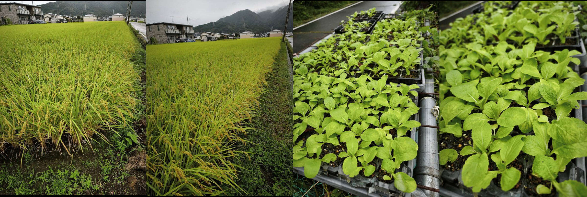

# 田んぼと畑：中之条

このファイルはランディングページ（LP）の**文章原稿**です。VS Code や Obsidian での直しは、この Markdown を正本にしてください。公開サイトの見た目は `index.html` が担います。

サイト名：佐藤農園  
URL：https://satofarms.com（satofarms.com）  
所在地：群馬県吾妻郡中之条町伊勢町15-6  
代表：佐藤節雄

---

## ヒーロー

守れ！日本の小さな農業、小さな米づくり

**田んぼと畑：中之条**

—— 田んぼと畑が育てる中之条の恵み ——

コシヒカリを中心に、野菜や果樹を育てる小さな農園。  
安全でおいしいものを、まっすぐにお届けします。

佐藤農園URL　https://satofarms.com（satofarms.com）

※ 背景の風景写真はAI生成のイメージ画像です。

英語版ページはこちら：[Read in English](../index-en.html)

---

## 現在のご案内

**[苦渋の決断――直販システム立ち上げ、一旦延期します](../blog/notes/a-difficult-decision.html)**

**[育てる直販] 中之条町のおいしいお米「さとう米」（コシヒカリ）**

■2026年産：ご購入のご案内 はこちら　■事前会員登録はこちら　■お見積もりシミュレーターはこちら

まもなく受付開始予定です。

佐藤農園URL　https://satofarms.com（satofarms.com）

---

## 新着情報

ここには最新10件だけ表示しています。

- 2026.9.7　田んぼと白菜の写真を[田畑の近況報告](../blog/field-report/)に追加しました。
- 2026.9.6　「地域に根を張るということ」— [読む](../blog/notes/rooted-in-the-community.html)
- 2026.8.31　「苦渋の決断――直販システム立ち上げ、一旦延期します」— [読む](../blog/notes/a-difficult-decision.html)
- 2026.8.30　「涼風を呼ぶ純白の舞い――中之条町「さぎ草祭り」」— [読む](../blog/notes/sagiso-festival.html)
- 2026.8.29　「佐藤農園：秋の生育メモ（独り言）」— [読む](../blog/notes/satofarms-autumn-note.html)
- 2026.8.28　「毎日の「面倒」をなくす。2ヶ月かけて作った原稿アップの仕組み」— [読む](../blog/notes/daily-automation.html)
- 2026.8.27　「コシヒカリ――美味しさと、農家の技術が育てた米」— [読む](../blog/notes/Koshihikari-rice.html)
- 2026.8.26　「AIとの付き合い方を見直す日。Cursorから無料のVS Codeへ、そして自動化へ」— [読む](../blog/notes/cursor-to-vscode.html)
- 2026.8.25　「しばらくお休みします」— [読む](../blog/notes/taking-a-short-break.html)
- 2026.8.24　「コシヒカリ――おいしさは、田んぼの時間から生まれる」を更新しました。— [読む](../blog/notes/koshihikari-field-time.html)

[新着情報の一覧を見る →](../blog/news/)

---

## 中之条町　自然と温泉の里

吾妻地方の田んぼと畑

この風景写真は生成AIによるイメージ画像です。

中之条町は、群馬県北西部・吾妻地方に位置する、四万温泉や沢渡温泉で知られる自然豊かな町です。四万川・名久田川の清冽な伏流水、昼夜の寒暖差、豊かな森林 — この風土が、佐藤農園のお米と野菜を育てます。

- **四万川・名久田川の伏流水**　ミネラル豊かな水が田んぼを潤す
- **あがつまの四季**　寒暖差が作物の旨味を凝縮
- **田んぼと畑**　お米（コシヒカリ）と野菜を栽培
- **温泉と自然**　四万・沢渡・尻焼など、全国に名を轟く温泉郷

### 名所URL集への入口

- [中之条町　名所URL集を見る](../blog/links/#spots-nakanojo)　温泉・自然・文化のリンク
- [吾妻郡　名所URL集を見る](../blog/links/#spots-agatsuma)　草津・八ッ場・嬬恋など

---

## 佐藤農園について

群馬県吾妻郡中之条町で、コシヒカリを中心に野菜や果樹を育てる小さな農園です。  
代表の佐藤節雄は、教育・医療の現場で培った誠実な姿勢を大切にしながら、日々の農作業に向き合っています。

「安全でおいしいものを、まっすぐに届けること」を信条に、土づくりから収穫まで丁寧に取り組んでいます。

---

## 商品・栽培

田んぼ・畑・果樹。販売先は友人・知人・ご近所様。現在販売中の商品と、お米づくりの実績をご紹介します。

### 新ジャガイモ

キャベツ：販売終了しました

市販価格の３割引きにて提供しています。 現在、友人・知人・ご近所様向けに提供しています。

価格：¥---

注文用

### コシヒカリ

田んぼ — 栽培

令和5年度実績：コシヒカリ  
１）１等級・食味値９０  
２）「花ゆかり」認定。

[2026年産 育てる直販米のご案内](#2026年産-育てる直販米のご案内)

### 柿・梅

果樹 — 栽培

果樹（栽培）：柿、梅  
干し柿、梅干し  
その他、さつまいもを乾燥芋にしています。

在庫・販売はお問合せ

### 収穫状況

- 収穫しました　にんにく・キャベツ・じゃがいも・玉ねぎ・トマト
- 収穫中です　キュウリ・なす・ニンジン

---

## キャッチコピー

守れ！日本の小さな農業、小さな米づくり

佐藤農園では、中之条町の小さな田んぼと畑にて、 コシヒカリの米づくりと野菜栽培に取り組んでいます。

令和5年度 — **コシヒカリ１等級・食味値９０**、**「花ゆかり」認定**。一方で、この数年は**雑草との戦い**に苦戦していて心折れる日々もあります。  
今後、日々感じる小規模兼業農家の喜怒哀楽を、多少なりとも、発信していければと思います。

[documents/hanayukari.pdf](../documents/hanayukari.pdf)（クリックすると小さなウインドーでPDFが開きます。LPはこのまま残ります）

---

## 田畑の近況報告

写真ギャラリーは [近況ページ](../blog/field-report/) へ移しました。ここには抜粋だけ載せています。「じゃがいも全滅記」は [ブログ記事](../blog/notes/potato-massacre.html) へ移しています。

畑と田んぼの様子を、写真と短文で不定期に更新しています。

2026.9.7.

田んぼ：あと２０日で稲刈りです。　白菜：今、畑に植え付け中です。

2026.7.5. 田んぼの様子。

2026.7.15. トリトマとゆりの花。

2026.8.19. 田んぼの様子。

2026.8.19. 畑の様子。

[近況の写真をもっと見る →](../blog/field-report/)

---

## 代表者プロフィール

代表 佐藤節雄（さとうせつお）

群馬県吾妻郡中之条町で、コシヒカリを中心に野菜や果樹を育てる小さな農園。  
教育・医療の現場で培った誠実な姿勢を大切にしながら、日々の農作業に向き合っています。

### 吾妻郡内の「米動向」は

- 群馬県の米は地域により主力品種が異なっています。中部・西部・東部の二毛作地帯は「ゴロピカリ」や「あさひの夢」が中心。吾妻郡を含む北部・東部の一毛作地帯は「コシヒカリ」が中心です。
- 北毛産コシヒカリは、全国食味ランキングでこれまで「特A」３回受賞の実績があります（平成20・21・令和2年産）。
- 近年、県内では新品種「にじのきらめき」の作付けが広がりつつあり、令和7年産群馬県産地品種銘柄一覧にも追加されました。
- 「にじのきらめき」の特徴は、コシヒカリ並みの食味に加えて、高温耐性・多収・倒伏しにくい・縞葉枯病に強いということです。
- 郡内の主力は依然としてコシヒカリですが、今後は高温耐性品種の導入・併用がさらに進む可能性がありそうです。　2026.7.5

中之条町ブランド米「花ゆかり」はこちら⇒ [花ゆかり](https://hanayukari.base.ec/)

中之条町のおいしいお米「さとう米」はこちら⇒ [会員登録へ](#pre-register)

### 経歴

- **教育**　早稲田大学教育学部 英語英文学科 卒業／群馬県立農林大学校社会人コース終了
- **現在**　農業従事／冬季はスキースクール専任講師
- **経歴**　県内公立高校 6校に勤務／郡内看護学校に勤務
- **農業**　田んぼ：コシヒカリ／畑：季節の野菜／果樹：柿、梅／その他：干し柿、梅干し、さつまいもの乾燥芋
- **趣味・関心事・心配事**　[ここをクリック](#趣味関心事心配事は何ですか)

スキー歴50年。今、自分史上----自分史上にて、最高の滑りを更新中。

つまり、今まで、どれだけ下手くそだったかということですが・・・

冬の間はスキースクール専任講師として、インバウンドの外国人を中心にスキーの楽しさを伝えています。教育現場で磨いた指導力を活かし、初心者から中級者まで、安心して学べるレッスンを提供しています。

---

## 農園ブログ

以前の「独り言コーナー」（#soliloquy）は [ブログ一覧](../blog/) へ移しました。全記事はそちらから読めます。

ブログ・新着・近況は専用ページへ移しました。最新の記事だけこちらに載せています。

- 2026.9.6　[地域に根を張るということ](../blog/notes/rooted-in-the-community.html)　ローカルに、万歳。祭りは、やっぱりいい。
- 2026.8.31　[苦渋の決断――直販システム立ち上げ、一旦延期します](../blog/notes/a-difficult-decision.html)　佐藤農園
- 2026.8.30　[涼風を呼ぶ純白の舞い――中之条町「さぎ草祭り」](../blog/notes/sagiso-festival.html)　さぎ草について

[ブログ一覧を見る](../blog/)

---

## よくある質問

### 一般の方も購入できますか？

販売先は友人・知人・ご近所様です。ご縁のある方からのお問い合わせは、固定電話にてご相談ください。

### お米の品種と品質は？

コシヒカリを栽培しています。令和5年度実績：コシヒカリ１等級・食味値９０、「花ゆかり」認定。在庫・価格は時期により異なります。

### 現在、何が買えますか？

現在、じゃがいもOKです。次は、秋の大根・白菜です。お米は在庫状況により異なりますので、お電話でお問い合わせください。

### 注文・問い合わせ方法は？

固定電話 [0279-75-2711](tel:0279752711)、携帯 [080-1256-8883](tel:08012568883)、メール [2324satou.setuo@gmail.com](mailto:2324satou.setuo@gmail.com) までご連絡ください（代表：佐藤節雄）。

### 「佐藤農園」の名称について

「佐藤農園」は、佐藤節雄が個人の農家として名乗る呼び名です。法人登録や商号登録をした名称ではありません。
URLは登録済みです。⇒satofarms.com

### 趣味・関心事／心配事は何ですか？

- 健康づくり（ジョギング）
- MLB鑑賞
- 蕎麦打ち（駆け出し）
- 造園グループ「四つ目垣」幹事
- パソコン自作（次は夢の４作目）
- 生成AI Cursor Pro、VS Code、Obsidian、GitHub、Netlify→Cloudflare
- FX（外国為替）トレード：戦績は不甲斐ないのだが、経験は誰にも負けない。数々の修羅場をくぐり抜け、20年選手となっている。ドル円トレードのノーハウ、教えます。
- 老朽化する生家の管理・修繕：少しでも土方仕事をすすめたい。
- 「スキー英語表現集」（英語・日本語対比）を作成。
- ホームページ立ち上げ：10数年前からの夢でした。今、Webという場を借りて、自分について表現したいことが三つあります。第一に、最近の自分のスキー滑走の映像、第二に、完全に暗記している「外郎売り」の口上（こうじょう）、そして第三に、般若心経の読経（どきょう）の様子です。いつか動画を載せてみたいと思っているのですが、果たしてどうなることでしょう？

---

## アクセス

群馬県吾妻郡中之条町伊勢町15-6

- **住所**　〒377-0423　群馬県吾妻郡中之条町伊勢町15-6
- **最寄り駅**　JR吾妻線「中之条駅」
- **お車の場合**　関越自動車道 渋川伊香保ICより国道353号方面（詳細はGoogleマップをご参照ください）

[Google マップ](https://www.google.com/maps/search/?api=1&query=%E7%BE%A4%E9%A6%AC%E7%9C%8C%E5%90%BE%E5%A6%BB%E9%83%A1%E4%B8%AD%E4%B9%8B%E6%9D%A1%E7%94%BA%E4%8A%8A%E5%8B%A2%E7%94%BA15-6)

※案内リンクは**小さなポップアップ**で開きます。スマホではポップアップになってません。戻りボタンを使って下さい。

### 案内用QRコード

地図案内  
読み取るとGoogleマップが開きます

ホームページ  
読み取るとこのサイトが開きます

[印刷用ページ（チラシ・掲示用）](../qr-print.html)

---

## 名所URL集

中之条町と吾妻郡の温泉・自然・文化。入口はこちらです。

- [中之条町　名所URL集を見る](../blog/links/#spots-nakanojo)　四万・沢渡・野反湖・ビエンナーレなど
- [吾妻郡　名所URL集を見る](../blog/links/#spots-agatsuma)　草津・八ッ場・嬬恋・高山・東吾妻など

---

## 2026年産 育てる直販米のご案内

[育てる直販] 中之条町のおいしいお米「さとう米」（コシヒカリ）

山あいの恵みを、直接あなたの食卓へ

群馬県中之条町・佐藤農園から、2026年産のお米をお届けします。

佐藤農園が始めるのは、単なる「お米の通販」ではありません。

その年の田んぼの状況や収穫量を見ながら、無理のない範囲でお客様に直接お届けする――。

私たちは、この仕組みを**「育てる直販」**と呼んでいます。

### 2026年産のお米を、直接届けたい

中之条町を含む群馬県北毛地域は、昼夜の寒暖差と清らかな水に恵まれています。

この地域のコシヒカリは、全国食味ランキングでこれまで3度「特A」を獲得しています。

佐藤農園では、こうした恵まれた土地で育てたお米を、できるだけ中間を通さず、お客様の食卓へ直接届けたいと考えています。

### 価格は、収穫までの状況を見ながら

お米は工場製品ではありません。

天候によって生育も収穫量も変わります。そのため、最初からすべてを固定するのではなく、田んぼの状況を確認しながら価格を決めていきます。

- **年初：参考価格　玄米30kg＝20,000円**
- **収穫前：仮価格　生育状況を見ながら調整**
- **収穫後：最終価格　収穫量・品質を確認して決定**

価格や収穫状況をできるだけ公開し、お客様との対話を大切にしながら販売します。

### 購入希望レベルを選んでください

会員登録は無料です。

現在のお気持ちに合わせて、3つのレベルから選んでいただけます。

**レベル1：関心がある**

今後の生育や販売状況を知りたい。

**レベル2：価格次第で検討したい**

最終価格が決まったら購入を考えたい。

**レベル3：ぜひ購入したい**

購入を希望しており、優先的な案内を受けたい。

これは「今すぐ注文する」という仕組みではありません。

収穫量がまだ確定していない段階から、お客様の購入希望を把握し、実際の収穫量に合わせて販売していくための仕組みです。

もし佐藤農園だけでは数量が足りなくなった場合には、信頼できる近隣農家にも協力をお願いし、地域で供給を支えることも考えています。

### 玄米でのお届けをおすすめします

佐藤農園では、玄米での購入をおすすめしています。

食べる直前に精米することで、香りやツヤをより楽しむことができます。ご家庭の精米機や、近所のコイン精米所もご利用いただけます。

### 田んぼから食卓まで、一緒に育てるお米

田植え、生育、出穂、そして収穫。

お米は、田んぼから食卓まで、長い時間をかけて育っていきます。

佐藤農園では、その一つひとつの過程を、できるだけ皆さんにお伝えしていきます。

「いくらで買うか」だけではなく、**「どんな田んぼで、どのように育っているのか」**も知っていただきたいからです。

2026年産「育てる直販米」は、まだ完成していません。

収穫量も、最終価格も、これから決まっていきます。

だからこそ、田んぼの様子を見ながら、**今年のお米が育っていく時間を、一緒に見守っていただきたい**と思っています。

**2026年産のお米に関心をお持ちの方は、ぜひ無料会員登録をお願いします。**

販売の準備が整い次第、ご登録いただいた連絡先へご案内します。

今年の田んぼの恵みを、佐藤農園からあなたの食卓へ。

---

## 事前会員登録

[育てる直販] 中之条町のおいしいお米「さとう米」（コシヒカリ）
事前会員登録はこちら

今年のお米の販売準備が整いましたら、ご登録のご連絡先へご案内します。  
住所の登録は不要です。パスワードもありません。

登録項目：

- お名前（必須）
- メールアドレス
- 電話番号
- メールアドレスまたは電話番号のいずれかは必須です
- 電話番号は9〜11桁で入力してください
- お米の購入希望レベル（必須）
  - Lv.1：関心あり。今後の動向を見たい
  - Lv.2：関心あり。価格により購入したい
  - Lv.3：ぜひ購入したい
- [プライバシーポリシー](../privacy.html)に同意する（必須）

会員登録する

---

## お問い合わせ

ご注文・ご質問は、お電話・メール、または下記フォームにてお気軽にどうぞ。販売先は友人・知人・ご近所様です。

- 固定電話 — 佐藤農園 代表 佐藤節雄　[0279-75-2711](tel:0279752711)
- 携帯　[080-1256-8883](tel:08012568883)
- メール　[2324satou.setuo@gmail.com](mailto:2324satou.setuo@gmail.com)

- **農園名**　佐藤農園
- **代表**　佐藤節雄
- **所在地**　群馬県吾妻郡中之条町伊勢町15-6

### お問い合わせフォーム

ご記入のうえ送信してください。

- お名前（必須）
- メールアドレス（必須）
- 電話番号
- お問い合わせ種別：商品について／お米について／その他
- お問い合わせ内容（必須）

送信する

---

## フッター

守れ！日本の小さな農業、小さな米づくり

佐藤農園

群馬県吾妻郡中之条町伊勢町15-6 — 代表 佐藤節雄

[TEL 0279-75-2711](tel:0279752711) / [携帯 080-1256-8883](tel:08012568883)

[2324satou.setuo@gmail.com](mailto:2324satou.setuo@gmail.com)

個人農家として「佐藤農園」と称しています。

[プライバシーポリシー](../privacy.html) / [特定商取引法に基づく表記](../tokushoho.html)

© 2026 佐藤農園
